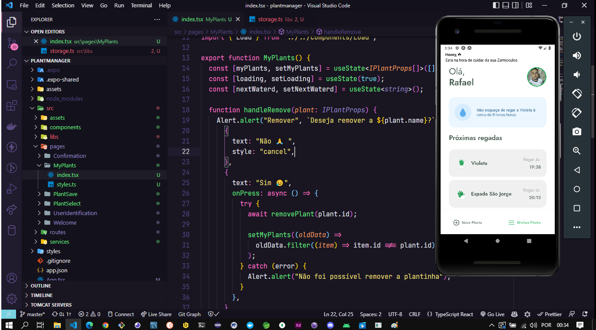

<h3 align="center">
    
    <br><br>
    <b> PlantManage é um Aplicativo para gerenciar suas plantas de forma fácil.</b>  
    <br>
</h3>


# Índice

- [Sobre](#sobre)
- [Tecnologias Utilizadas](#tecnologias-utilizadas)
- [Conceitos Aprendido](#conceito-aprendido)
- [Como Usar](#como-usar)
- [Como Contribuir](#como-contribuir)

## :bookmark: Sobre
O <strong>PlantManager</strong> é um aplicativo para auxiliar as pessoas a cuidar das suas plantas - gerencie suas plantas de forma fácil.


<a id="tecnologias-utilizadas"></a>

## :rocket: Tecnologias Utilizadas

O projeto foi desenvolvido utilizando as seguintes tecnologias

## Mobile

- [React Native](https://developer.mozilla.org/pt-BR/docs/Aprender/HTML/Introducao_ao_HTML)
- [Expo](https://developer.mozilla.org/pt-BR/docs/Web/JavaScript)
- [Css](https://developer.mozilla.org/pt-BR/docs/Web/JavaScript)
- [TypeScript](https://developer.mozilla.org/pt-BR/docs/Web/JavaScript)


<a id="#conceito-aprendido"></a>

## CONCEITO APRENDIDO

- Principios de UX/UI
- Utilizando AsyncStorage
- Consumo de Api Fake
- Utilizando Notificação
- Listagem de dados
- Animações
- Scroll Infinito
- TabNavegation
- Filtro de dados da api


## :heavy_check_mark: :iphone: Versão Desktop e Mobile

<h1 align="center">
    
</h1>

## :heavy_check_mark: :computer: Video da Aplicação

<h1 align="center">
    
</h1>


<a id="como-usar"></a>

## :fire: Como usar
O projeto foi desenvolvido utilizando as seguintes tecnologias

1. Faça um clone :

```sh
  $ git clone https://github.com/Rafael-Rufino/plantmanager
```

2. Executando a Aplicação:

```sh
  # Instale as dependências
  $ npm install 
  ou 
  $ Yarn

  # Inicie a aplicação web
  $ cd plantmanage
  $ expo start
  # Utilize o endereço ip da sua maquina - rodas API - fake
  $ json-server ./src/services/server.json --host 192.168.1.3 --port 3333

```

<a id="como-contribuir"></a>


# :recycle: Como contribuir

- Faça um Fork desse repositório,
- Crie uma branch com a sua feature: `git checkout -b my-feature`
- Commit suas mudanças: `git commit -m 'feat: My new feature'`
- Push a sua branch: `git push origin my-feature`


## :memo: License

Esse projeto está sob a licença MIT. Veja o arquivo [LICENSE](LICENSE.md) para mais detalhes.


<h4 align="center">
    Feito com 💜 by <a href="https://portfolio-rafael-rufino.vercel.app/" target="_blank">Rafael Rufino</a>
</h4>
